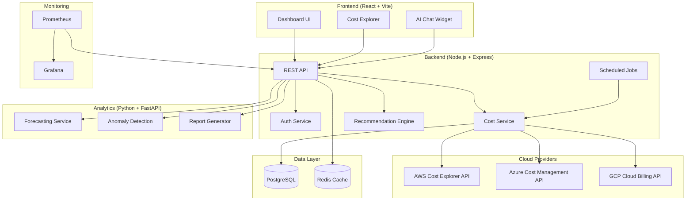

# ☁️ CloudCostIQ — AI-Powered Cloud Cost Optimization Platform

[](https://github.com)
[](LICENSE)
[](https://nodejs.org)
[](https://react.dev)
[](https://python.org)
[](https://terraform.io)

> **CloudCostIQ** is a full-stack FinOps platform that collects cost data from AWS, Azure, and GCP, visualizes spending trends, detects anomalies, forecasts future costs, and provides AI-powered optimization recommendations — all from a single, beautiful dashboard.

---

## 🏗️ Architecture Overview



## 📂 Project Structure

```
cloud-cost-iq/
├── frontend/           → React dashboard (Vite, Recharts, Zustand)
├── backend/            → Node.js REST API (Express, Sequelize, JWT)
├── python/             → ML analytics (FastAPI, Prophet, scikit-learn)
├── terraform/          → Infrastructure as Code (AWS/Azure/GCP)
├── kubernetes/         → K8s manifests (Kustomize overlays)
├── prometheus/         → Monitoring configuration
├── grafana/            → Dashboard definitions as code
├── .github/workflows/  → CI/CD pipelines
└── docs/               → Architecture & API documentation
```

## 🚀 Quick Start (Local Development)

### Prerequisites
- **Node.js** 20+ LTS
- **Python** 3.12+
- **Docker** & **Docker Compose**
- **Git**

### 1. Clone & Install

```bash
git clone https://github.com/your-org/cloud-cost-iq.git
cd cloud-cost-iq

# Install backend dependencies
cd backend && npm install && cd ..

# Install frontend dependencies
cd frontend && npm install && cd ..

# Install Python dependencies
cd python && pip install -r requirements.txt && cd ..
```

### 2. Set Up Environment Variables

```bash
# Copy example env files (NEVER commit real .env files!)
cp backend/.env.example backend/.env
cp frontend/.env.example frontend/.env
```

Edit the `.env` files with your local settings (database URL, API keys, etc.)

### 3. Start with Docker Compose

```bash
# This starts PostgreSQL, Redis, backend, frontend, python service,
# Prometheus, and Grafana — all wired together
docker-compose up -d

# View logs
docker-compose logs -f
```

### 4. Access the Application

| Service      | URL                        | Description                    |
|-------------|----------------------------|--------------------------------|
| Frontend    | http://localhost:5173       | React Dashboard                |
| Backend API | http://localhost:4000       | REST API                       |
| API Docs    | http://localhost:4000/api-docs | Swagger UI                  |
| Python API  | http://localhost:8000       | Analytics Service              |
| Grafana     | http://localhost:3001       | Monitoring Dashboards          |
| Prometheus  | http://localhost:9090       | Metrics                        |

## 🛠️ Tech Stack

| Layer          | Technology                                              |
|---------------|---------------------------------------------------------|
| Frontend      | React 18, Vite, Recharts, Zustand, Framer Motion       |
| Backend       | Node.js, Express, Sequelize ORM, JWT, Swagger           |
| Analytics     | Python, FastAPI, Prophet, scikit-learn, Pandas           |
| Database      | PostgreSQL 16, Redis 7                                  |
| Cloud SDKs    | AWS SDK v3, Azure SDK, Google Cloud Client Libraries     |
| IaC           | Terraform with modular architecture                      |
| Orchestration | Kubernetes (EKS/AKS/GKE), Kustomize                    |
| Monitoring    | Prometheus, Grafana, OpenCost                            |
| CI/CD         | GitHub Actions, Docker, Trivy, CodeQL                    |
| AI            | OpenAI GPT-4 / Claude API for chat advisor               |

## 📊 Features

- **Multi-Cloud Cost Dashboard** — Unified view of AWS, Azure, GCP spending
- **Cost Explorer** — Drill down by service, environment, tag, date range
- **AI Chat Advisor** — Ask questions like "Why is my AWS bill high?"
- **Forecasting** — ML-powered 30/60/90-day cost predictions
- **Anomaly Detection** — Automatic alerts for unusual spending spikes
- **Idle Resource Detection** — Find unused EBS, EIPs, idle instances
- **Rightsizing Recommendations** — Optimize instance types with savings estimates
- **Budget Alerts** — Set thresholds, get Slack/email notifications
- **PDF/Excel Reports** — Automated monthly FinOps reports
- **Kubernetes Cost Allocation** — Per-namespace cost breakdown via OpenCost

## 🔒 Security

- JWT authentication with bcrypt password hashing
- Helmet.js security headers on all API responses
- Input validation & sanitization (express-validator)
- Rate limiting to prevent abuse
- Secrets managed via environment variables (never committed)
- Container image scanning with Trivy
- RBAC and NetworkPolicies in Kubernetes
- TLS/HTTPS enforced everywhere

## 📄 Documentation

- [Architecture Deep Dive](docs/architecture.md)
- [API Documentation](docs/api-docs.md)
- [Deployment Guide](docs/deployment-guide.md)

## 🤝 Contributing

1. Fork the repository
2. Create a feature branch (`git checkout -b feat/amazing-feature`)
3. Commit changes (`git commit -m 'feat: add amazing feature'`)
4. Push to branch (`git push origin feat/amazing-feature`)
5. Open a Pull Request

## 📜 License

This project is licensed under the MIT License — see the [LICENSE](LICENSE) file for details.
