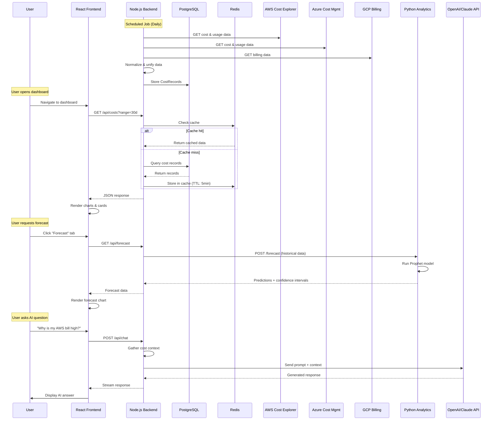
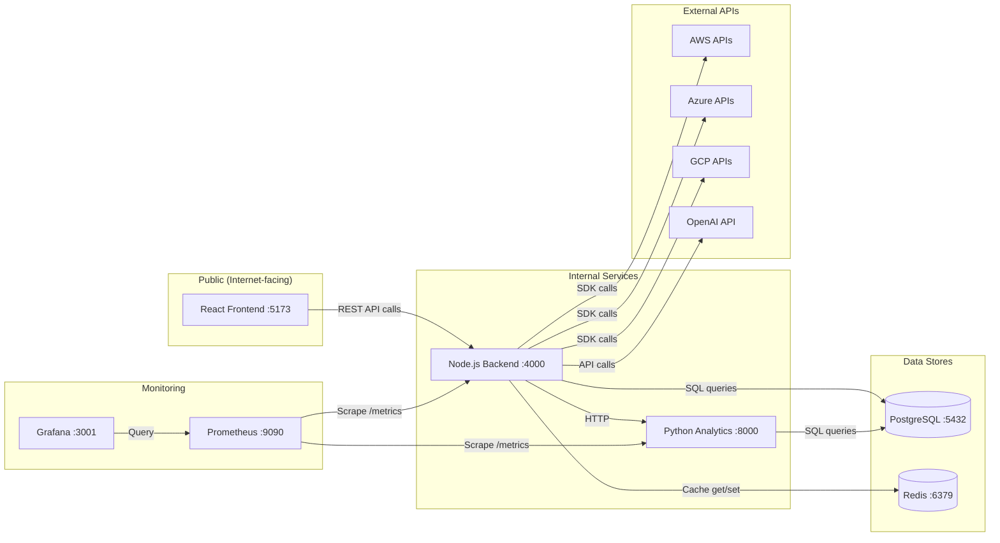
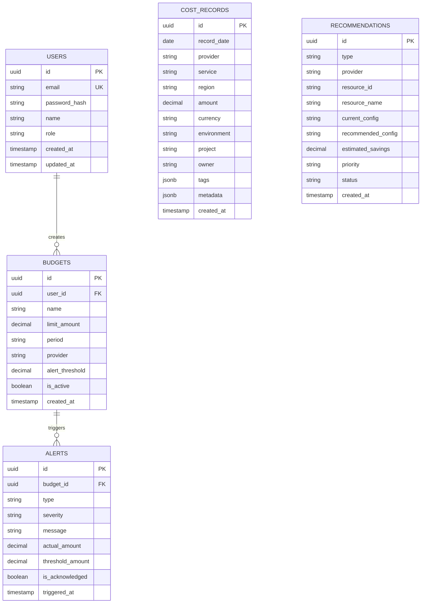
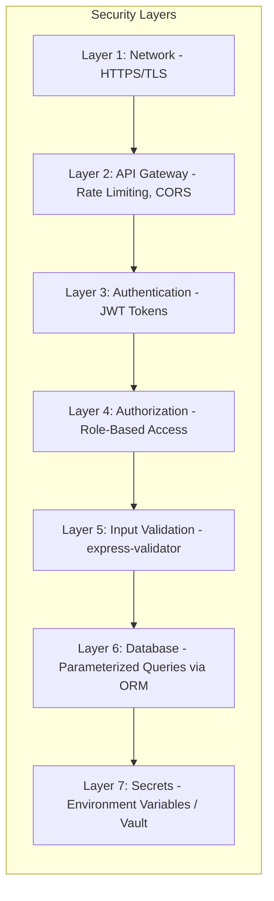

# CloudCostIQ — Architecture Deep Dive

## System Architecture

CloudCostIQ follows a **microservices architecture** — instead of one giant application, we split functionality into small, independent services that communicate over HTTP. This is important because:

1. **Independent scaling** — If the frontend gets 10x traffic, scale only the frontend
2. **Technology freedom** — Use Node.js for APIs, Python for ML, React for UI
3. **Fault isolation** — If the analytics service crashes, the dashboard still works
4. **Team independence** — Different teams can work on different services

## High-Level Data Flow

## Service Communication Map

## Database Schema (ERD)

## Key Design Decisions

### Why Express over NestJS?
- **Simpler to learn** — Express is minimal and explicit, making it easier to understand what's happening
- **More flexibility** — NestJS adds opinions and abstractions that are great for large teams but add complexity
- **Industry standard** — Express is the most widely used Node.js framework

### Why Sequelize ORM?
- **SQL generation** — Writes SQL for you, preventing SQL injection attacks
- **Migrations** — Version-controls your database schema changes
- **Model definitions** — Define your data structure in JavaScript, not raw SQL
- **Multi-DB support** — Works with PostgreSQL, MySQL, SQLite (easy testing)

### Why Zustand over Redux?
- **90% less boilerplate** — Redux requires actions, reducers, dispatchers; Zustand is just a hook
- **Simpler mental model** — State is just a JavaScript object with updater functions
- **Built-in devtools** — Great debugging without extra setup

### Why FastAPI for Python service?
- **Performance** — Async support makes it faster than Flask
- **Auto-documentation** — Swagger docs generated automatically
- **Type safety** — Pydantic models validate data automatically
- **ML-friendly** — Python ecosystem is best for data science

### Why separate Python service?
- **Best tool for the job** — Python has Prophet, scikit-learn, pandas — Node.js doesn't
- **Independent scaling** — Forecasting is CPU-intensive; scale it independently
- **12-Factor App** — Each service does ONE thing well

## Security Architecture

## Environment Strategy

| Environment | Purpose | Database | Cloud APIs | Deployment |
|------------|---------|----------|------------|------------|
| **Local** | Development | Docker PostgreSQL | Mock data | docker-compose |
| **Dev** | Integration testing | Cloud-hosted DB | Real APIs (sandbox) | K8s dev namespace |
| **Prod** | Production | Managed RDS (multi-AZ) | Real APIs | K8s prod namespace |
